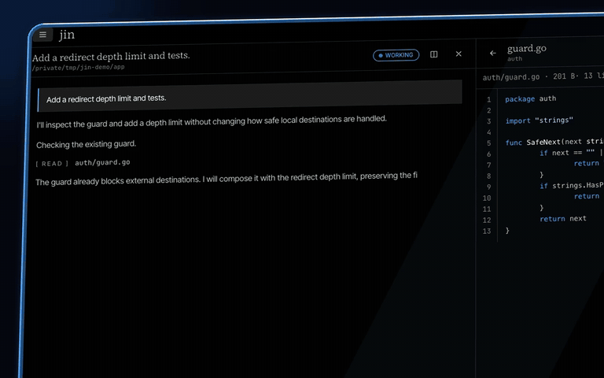

# Jin: a fast, simple, and stable AI coding agent for TUI and WebUI



[Download the demo video](docs/demo.mp4)

Jin is a simple, even slightly boring AI coding agent. It comes with the tools you need
to get started, without a config file to maintain. It is working toward a stable v1.0.

If you are tired of AI hype and rebuilding your workflow every week, Jin is for you.
We deliberately left things out to build a straightforward agent that gets your work done.

Jin is built to be fast and token-efficient. Stable request prefixes help providers reuse
cached context. In the Claude Sonnet benchmark below, Jin used slightly fewer input tokens
and cost less than Pi, with the same pass rate. Cache hit rates depend on the provider and workload.

## Philosophy

- **No plugins.** Built-in tools cover everyday coding. Extend Jin through
  [prompts and hooks](docs/prompts-and-hooks.md), not a plugin ecosystem.
- **No skills or MCP required.** Use prompts and CLI tools instead. The
  [gallery](docs/gallery.md) includes skill-style prompts and a template for an external MCP-to-CLI adapter.
- **Context control.** Choose the instructions and tools your agent uses. Edit the
  [system prompt](docs/prompts-and-hooks.md#the-system-prompt-compaction-and-handoff) from inside Jin.
- **Stable and clear.** Know your agent, keep your workflow, and get on with your work.

## Install

macOS and Linux, arm64 and amd64:

```sh
curl -fsSL https://raw.githubusercontent.com/ethanhamilthon/jin/main/install.sh | sh
```

The script downloads the latest release, checks its SHA-256 and installs `jin` into
`/usr/local/bin` (or `~/.local/bin`). Run it again to update: it replaces the installed
`jin` and prints the version it installed. `JIN_VERSION=v0.11.0` pins a release. Later,
`jin update` does the same from jin itself. Then run `jin` in the project you want to work
on.

## Run

Run Jin in the project you want to work on:

- `jin web` starts the WebUI on `127.0.0.1` and opens it in your browser.
- `jin` starts the TUI in your terminal.

See the [WebUI guide](docs/web.md) or the [TUI guide](docs/tui.md) for controls.

## Connect a model

On first launch, connect your OpenAI or Anthropic API, or a compatible API, and choose a model.
You can change providers later in settings or with `/provider` in the TUI.

Jin does not sign in with subscriptions (ChatGPT Plus/Pro, Claude Pro/Max and so on). To
use one, run [EasyCLIProxyAPI](https://github.com/router-for-me/EasyCLIProxyAPI), a desktop
app that serves your subscription as a local OpenAI-compatible API.

## Build from source

```sh
git clone https://github.com/ethanhamilthon/jin && cd jin
make build        # bin/jin, keeps its data in ~/.jin-dev
make install      # release build into /usr/local/bin, data in ~/.jin
```

Requires Go 1.27 or newer, and Node 22 for the `jin web` UI (without it the build skips
the UI). Forks are welcome; read [AGENTS.md](AGENTS.md) for the rules of
the code base.

## Benchmarks

Tested on Aider Polyglot Python tasks using Harbor (one run per agent and task, Docker containers). Execution time, request count, and token usage are measured via a logging reverse proxy. See [docs/benchmarks.md](docs/benchmarks.md) for full breakdown and methodology.

### 20 Python tasks on `gpt-6-luna` (high effort)

| Agent | Passed | Agent time, s | Requests | Input (Cached) | Output (Reasoning) | Cost, USD |
| --- | --- | --- | --- | --- | --- | --- |
| codex | 12/20 (60%) | 49 | 4.4 | 48.0k (39.9k) | 1 548 (752) | $0.00198 |
| **jin (v0.7.2)** | 11/20 (55%) | 65 | 7.7 | 24.9k (14.8k) | 2 323 (993) | $0.00231 |
| pi | 10/20 (50%) | 52 | 5.5 | 14.4k (7.9k) | 1 604 (817) | $0.00154 |
| opencode | 9/20 (45%) | 106 | 11.4 | 79.7k (62.4k) | 2 221 (698) | $0.00347 |

### 10 Python tasks on `claude-sonnet-5-5` (medium effort)

| Agent | Passed | Agent time, s | Requests | Input (Cached) | Output | Cost, USD |
| --- | --- | --- | --- | --- | --- | --- |
| claude-code | 8/10 (80%) | 13 | 3.3 | 77.6k (70.5k) | 1 189 | $0.06028 |
| **jin (v0.7.2)** | 7/10 (70%) | 15 | 3.5 | 13.0k (10.2k) | 1 389 | $0.03231 |
| pi | 7/10 (70%) | 16 | 3.4 | 13.1k (9.8k) | 1 383 | $0.03344 |
| opencode | 7/10 (70%) | 39 | 5.0 | 50.2k (42.0k) | 1 867 | $0.06532 |

## Security

The agent has `bash` with no restrictions and no confirmation dialogs. `bash`, `write` and
`edit` act directly on your machine with your permissions. Run jin only in projects where
that is acceptable, and review project hooks before you trust a repository.

## Docs

[docs/](docs/README.md) covers keys and work-view commands, projects and panes, hooks and
prompts, headless mode (`jin -p`), the browser UI (`jin web`), background tasks, settings and
the database. Jin reads these
docs when you ask it about its own commands.

## License

[MIT](LICENSE) © 2026 Yerdana Yerbol.
