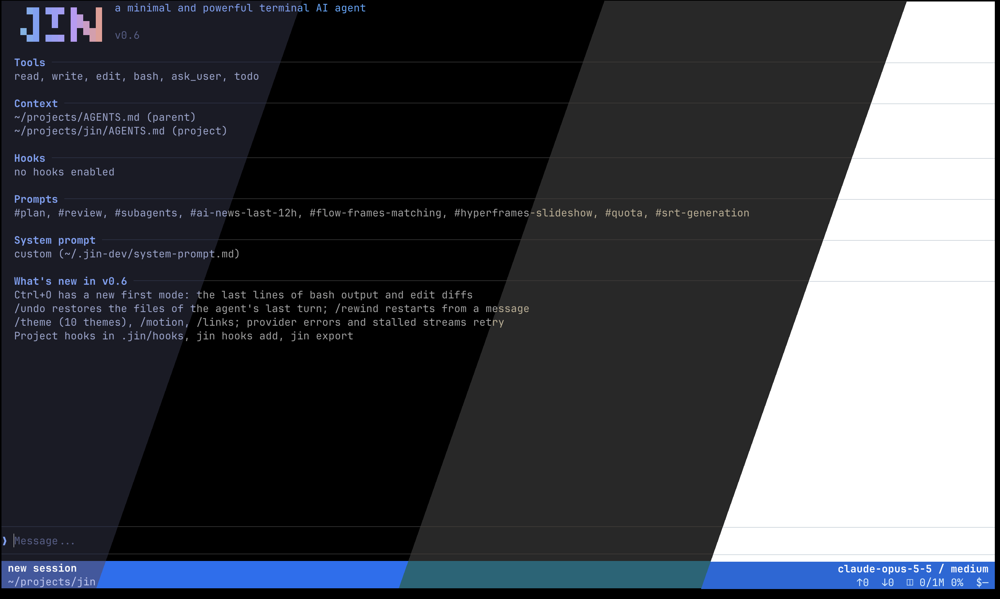

# Jin: a terminal coding agent in Go



Jin is a terminal coding agent in one Go binary. It reads files, edits code and runs
commands through a model API. A bare `jin` starts a new session in the current project
directory. Slash commands open sessions, projects, providers, prompts, hooks, background
tasks and settings above the input, without leaving the work view. Split work into up to four
panes with one shared input and status area. Use a leading `$` for shell commands and `/tui` for interactive full-screen
programs. See the [TUI guide](docs/tui.md) for controls.

Jin includes background tasks, undo, themes and headless mode. Choose a provider
and model on the first run; there is no config file to write. Save reusable instructions as
prompts and call them with `#prompt-name`. To add a tool, install its CLI and describe it in
a hook. Jin calls it through the shell. See [Extending jin](docs/extending.md).

## In the browser

`jin web` serves the same jin on `127.0.0.1` and opens it in the browser: projects,
sessions, up to four panes, streaming answers with diffs, `/commands`, `#prompts`,
`@files`, pictures and `$` shell input. It shares all data with the TUI. See
[docs/web.md](docs/web.md).

## Install

macOS and Linux, arm64 and amd64:

```sh
curl -fsSL https://raw.githubusercontent.com/ethanhamilthon/jin/main/install.sh | sh
```

The script downloads the latest release, checks its SHA-256 and installs `jin` into
`/usr/local/bin` (or `~/.local/bin`). Run it again to update: it replaces the installed
`jin` and prints the version it installed. `JIN_VERSION=v0.9.0` pins a release. Later,
`jin update` does the same from jin itself. Then run `jin` in the project you want to work
on.

## Connect a model

The first start shows a setup screen: choose OpenAI Responses, OpenAI Chat Completions or
Anthropic, then enter the URL, key, model and effort. That covers OpenAI, Anthropic,
OpenRouter and local servers. Manage saved providers with `/provider`.

Jin does not sign in with subscriptions (ChatGPT Plus/Pro, Claude Pro/Max and so on). To
use one, run [EasyCLIProxyAPI](https://github.com/router-for-me/EasyCLIProxyAPI), a desktop
app that serves your subscription as a local OpenAI-compatible API, and add its address with
`/provider`.

## Build from source

```sh
git clone https://github.com/ethanhamilthon/jin && cd jin
make build        # bin/jin, keeps its data in ~/.jin-dev
make install      # release build into /usr/local/bin, data in ~/.jin
```

Requires Go 1.27 or newer, and Node 22 for the `jin web` UI (without it the build skips
the UI). Forks are welcome; read [AGENTS.md](AGENTS.md) for the rules of
the code base.

## Benchmarks

Tested on Aider Polyglot Python tasks using Harbor (one run per agent and task, Docker containers). Execution time, request count, and token usage are measured via a logging reverse proxy. See [docs/benchmarks.md](docs/benchmarks.md) for full breakdown and methodology.

### 20 Python tasks on `gpt-6-luna` (high effort)

| Agent | Passed | Agent time, s | Requests | Input (Cached) | Output (Reasoning) | Cost, USD |
| --- | --- | --- | --- | --- | --- | --- |
| codex | 12/20 (60%) | 49 | 4.4 | 48.0k (39.9k) | 1 548 (752) | $0.00198 |
| **jin (v0.7.2)** | 11/20 (55%) | 65 | 7.7 | 24.9k (14.8k) | 2 323 (993) | $0.00231 |
| pi | 10/20 (50%) | 52 | 5.5 | 14.4k (7.9k) | 1 604 (817) | $0.00154 |
| opencode | 9/20 (45%) | 106 | 11.4 | 79.7k (62.4k) | 2 221 (698) | $0.00347 |

### 10 Python tasks on `claude-sonnet-5-5` (medium effort)

| Agent | Passed | Agent time, s | Requests | Input (Cached) | Output | Cost, USD |
| --- | --- | --- | --- | --- | --- | --- |
| claude-code | 8/10 (80%) | 13 | 3.3 | 77.6k (70.5k) | 1 189 | $0.06028 |
| **jin (v0.7.2)** | 7/10 (70%) | 15 | 3.5 | 13.0k (10.2k) | 1 389 | $0.03231 |
| pi | 7/10 (70%) | 16 | 3.4 | 13.1k (9.8k) | 1 383 | $0.03344 |
| opencode | 7/10 (70%) | 39 | 5.0 | 50.2k (42.0k) | 1 867 | $0.06532 |

## Security

The agent has `bash` with no restrictions and no confirmation dialogs. `bash`, `write` and
`edit` act directly on your machine with your permissions. Run jin only in projects where
that is acceptable, and review project hooks before you trust a repository.

## Docs

[docs/](docs/README.md) covers keys and work-view commands, projects and panes, hooks and
prompts, headless mode (`jin -p`), background tasks, settings and the database. Jin reads these
docs when you ask it about its own commands.

## License

[MIT](LICENSE) © 2026 Yerdana Yerbol.
